# A brief tutorial on runing Maxent in R
Xiao Feng, Cassondra Walker, Fikirte Gebresenbet  
July 4, 2017  
##1. Set up the working environment  
###1.1 Load packages  
Running Maxent in R requires several packages. Specifically, the "dismo" package, which contains *maxent* function that calls *maxent.jar* in R, the *raster* package, which provides functions for analyzing gridded data, the *rgeos* package, which provides functions for analyzing spatial data.

#####Thread 1

```r
library("dismo")
library("raster")
library("rgeos")
```
																												   
If you are using a Mac machine, an additional step may be needed  

#####Thread 2

```r
#dyn.load('/Library/Java/JavaVirtualMachines/jdk1.8.0_144.jdk/Contents/Home/jre/lib/server/libjvm.dylib')
library("rJava")
```

#####Thread 3
settings for the rmarkdown document

```r
library("knitr")
knitr::opts_knit$set(root.dir = '/Users/iel82user/Google Drive/1_osu_lab/projects/2017_7_workshop_enm_R/code')
opts_chunk$set(tidy.opts=list(width.cutoff=60),tidy=TRUE)
```

###1.2 Set up the Maxent path  
In order for Maxent to work properly in R, the *maxent.jar* file needs to be accessible by *dismo* package.  

#####Thread 4

```r
# download maxent.jar 3.3.3k, and place the file in the
# desired folder
utils::download.file(url = "https://raw.githubusercontent.com/mrmaxent/Maxent/master/ArchivedReleases/3.3.3k/maxent.jar", 
    destfile = paste0(system.file("java", package = "dismo"), 
        "/maxent.jar"), mode = "wb")  ## wb for binary file, otherwise maxent.jar can not execute

# also note that both R and Java need to be the same bit
# (either 32 or 64) to be compatible to run

# to increase memory size of the JVM and prevent memory
# issues with Maxent.jar use: options( java.parameters =
# c('-Xss2560k', '-Xmx2g') )
```


##2. Prepare data input  
###2.1 Load environmental layers 
In our example, we used bioclimatic variables (downloaded from worldclim.org) as input environmental layers. We stack our environmental layers so that they may be processed simultaneously.  

#####Thread 5 

```r
# This searches for all files that are in the path
# 'data/bioclim/' and have a file extension of .bil. You can
# edit this code to reflect the path name and file extension
# for your environmental variables
clim_list <- list.files("../data/bioclim/", pattern = ".bil$", 
    full.names = T)

# stacking the bioclim variables to process them at one go
clim <- raster::stack(clim_list)
```

###2.2 Occurrence data  
####2.2.1 Download occurrence data  
For our example, we downloaded occurrence data of the nine banded armadillo from GBIF.org (Global Biodiversity Information Facility). We have provided an if/else statement that checks for a file with “data/occ-raw” in the pathname. If a file does exist, R will load this file, otherwise it will download occurrence locations for _Dasypus novemcinctus_, the nine banded armadillo, and save it as a .csv file named “data/occ_raw.csv”.  

#####Thread 6

```r
if (file.exists("../data/occ_raw")) {
    load("../data/occ_raw")
} else {
    occ_raw <- gbif("Dasypus novemcinctus")
    save(occ_raw, file = "../data/occ_raw")
    write.csv("../data/occ_raw.csv")
}

# View the first few lines of the occurrence dataset head(
# occ_raw )
```

####2.2.2 Clean occurrence data
Since some of our records do not have appropriate coordinates and some have missing locational data, we need to remove them from our dataset. To do this, we create a new dataset named “occ_clean”, which is a subset of the “occ_raw” dataset where records with missing latitude and/or longitude are removed. This particular piece of code also returns the number of records that were removed from the dataset. Additionally, we remove duplicate records and create a subset of the cleaned data with the duplicates removed. 

#####Thread 7

```r
# remove bad coordinates, where either the latitude or
# longitude is missing
occ_clean <- subset(occ_raw, (!is.na(lat)) & (!is.na(lon)))
cat(nrow(occ_raw) - nrow(occ_clean), "records are removed")
```

```
## 2426 records are removed
```

```r
# remove duplicated data based on latitude and longitude
dups <- duplicated(occ_clean[c("lat", "lon")])
occ_unique <- occ_clean[!dups, ]
cat(nrow(occ_clean) - nrow(occ_unique), "records are removed")
```

```
## 1506 records are removed
```

Up to this point we have been working with a data frame, but it has no spatial relationship with environmental layers. So we needed to make the data spatial. Once our data is spatial we can use the *plot* function to see the occurrence data and allow us to check for data points that appear to be erroneous.

#####Thread 8

```r
# make occ spatial
coordinates(occ_unique) <- ~lon + lat
## look for erroneous points
plot(occ_unique)
```

<!-- -->

In Figure above, we can see several points that appear outside the known distribution of _Dasypus novemcinctus_ (North and South America) and we need to remove these from our occurrence data set. To do this we select points that have longitudes lower than -110 or greater than -40 (outside our area of interest) and remove them from the data set. 

#####Thread 9

```r
# remove some errors (i.e., only keep good records)
occ_unique <- occ_unique[which(occ_unique$lon > -110 & occ_unique$lon < 
    -40), ]
```

We want to use only one occurrence point per pixel, so we need to thin our occurrence data.

#####Thread 10

```r
# thin occ data (keep one occ per cell)
cells <- cellFromXY(clim[[1]], occ_unique)
dups <- duplicated(cells)
occ_final <- occ_unique[!dups, ]
cat(nrow(occ_unique) - nrow(occ_final), "records are removed")
```

```
## 1124 records are removed
```

```r
# plot the first climatic layer (or )
plot(clim[[1]])
# replace [[1]] with any nth number of the layer of interest
# from the raster stack

# plot the final occurrence data on the enviromental layer
plot(occ_final, add = T, col = "red")  # the 'add=T' tells R to put the incoming data on the existing layer
```

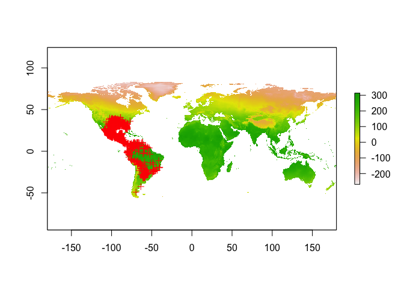<!-- -->

###2.3 Set up study area
We create a buffer around our occurrence locations and define this as our study region, which will allows us to avoid sampling from a broad background. We establish a four-decimal-degree buffer around the occurrence points. To make sure that our buffer encompasses the appropriate area, we plot the occurrence points, the first environmental layer, and the buffer polygon.

#####Thread 11

```r
# this creates a 4 decimal degree buffer around the
# occurrence data
occ_buff <- buffer(occ_final, 4)

# plot the first element ([[1]]) in the raster stack
plot(clim[[1]])
# this adds the occurrence data
plot(occ_final, add = T, col = "red")
# this adds the buffer polygon
plot(occ_buff, add = T, col = "blue")
```

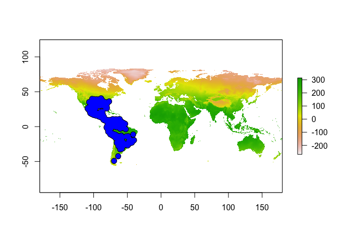<!-- -->

With a defined study area and the environmental layers stacked, we then clip the layers to the extent of our study area. However, for ease of processing, we do this in two steps rather than one. First we create a coarse rectangular shaped study area around the study area to reduce the size of environmental data and then extract by *mask* using the buffer we created to more accurately clip environmental layers. This approach could be faster than directly masking. We save the cropped environmental layers as .asc (ascii files) as inputs for Maxent.

#####Thread 12

```r
# crop study area to a manageable extent (rectangle shaped)
studyArea <- crop(clim,extent(occ_buff))  

# the 'study area' created by extracting the buffer area from the raster stack
studyArea <- mask(studyArea,occ_buff)
# output will still be a raster stack, just of the study area

# save the new study area rasters as ascii
writeRaster(studyArea,
            # a series of names for output files
            filename=paste0("../data/studyarea/",names(studyArea),".asc"), 
            format="ascii", ## the output format
            bylayer=TRUE, ## this will save a series of layers
            overwrite=T)
```

In the next step, we selected 10,000 random background points from the study area. To make our experiment reproducable (i.e., select the same set of points), we used a static seed via *set.seed(1)* function. Then, we ploted the backround points together with the study area and occurrence data.

#####Thread 13

```r
# select background points from this buffered area; when the number provided 
# to set.seed() function, the same random sample will be selected in the next line			
# use this code before the sampleRandom function everytime, if you want to get
# the same "random samples"
set.seed(1) 
bg <- sampleRandom(x=studyArea,
                   size=10000,
                   na.rm=T, #removes the 'Not Applicaple' points  
                   sp=T) # return spatial points 

plot(studyArea[[1]])
# add the background points to the plotted raster
plot(bg,add=T) 
# add the occurrence data to the plottted raster
plot(occ_final,add=T,col="red")
```

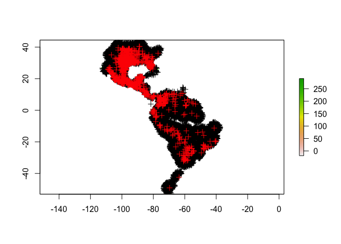<!-- -->

###2.4 Split occurrence data into training & testing
We randomly selected 50% of the occurrence data for model training and the left for model testing. To make our experiment reproducable (i.e., select the same set of points), we used a static seed via *set.seed(1)* function.

#####Thread 14

```r
# get the same random sample for training and testing
set.seed(1)

# randomly select 50% for training
selected <- sample(1:nrow(occ_final), nrow(occ_final) * 0.5)
# this is the selection
occ_train <- occ_final[selected, ]

# this is the opposite of the selection
occ_test <- occ_final[-selected, ]
```

###2.5 Format data for Maxent
The data input can either be spatial or tabular. In our example, we used the tabular format, which can be potentially more flexible. We extract environmental conditions for backround, training, and testing points in a dataframe format. 

#####Thread 15

```r
# extracting env conditions for training occ from the raster
# stack; a data frame is returned (i.e multiple columns)
p <- extract(clim, occ_train)
# env conditions for testing occ
p_test <- extract(clim, occ_test)
# extracting env conditions for background
a <- extract(clim, bg)
```

Maxent reads a "1" as presence and "0" as pseudo-absence. Thus, we need to assign a "1" to the training environmental conditions and a "0" for the background. We created a set of rows with the same number as the training and testing data, and put the value of "1" each cell and a "0" for background. We combined the "1"s and "0"s into a vector that was added to the dataframe containing the environmental conditions associated with the testing and background conditions.

#####Thread 16

```r
# repeat the number 1 as many numbers as the number of rows
# in p, and repeat 0 as the rows of background points
pa <- c(rep(1, nrow(p)), rep(0, nrow(a)))

# (rep(1,nrow(p)) creating the number of rows as the p data
# set to have the number one as the indicator for presence;
# rep(0,nrow(a)) creating the number of rows as the a data
# set to have the number zero as the indicator for absence;
# the c combines these ones and zeros into a new vector that
# can be added to the Maxent table data frame with the
# environmental attributes of the presence and absence
# locations
pder <- as.data.frame(rbind(p, a))
```

##3 Maxent models
###3.1 Simple implementation

#####Thread 17

```r
# mod <- maxent(x=climatic data, p=occurrence data, path=output location)
mod <- maxent(x=pder, ## env conditions
              p=pa,   ## 1:presence or 0:absence

              path=paste0("../output/maxent_outputs"), ## folder for maxent output; 
              # if we do not specify a folder R will put the results in a temp file, 
              # and it gets messy to read those. . .
              args=c("responsecurves") ## parameter specification
              )
# the maxent functions runs a model in the default settings..to change these parameters,
# you have to tell it what you want...i.e. response curves or the the type of features

# view the maxent model in a html brower
mod
```

```
## class    : MaxEnt 
## variables: bio1 bio10 bio11 bio12 bio13 bio14 bio15 bio16 bio17 bio18 bio19 bio2 bio3 bio4 bio5 bio6 bio7 bio8 bio9
```

```r
# view detailed results
mod@results
```

```
##                                                                                          [,1]
## X.Training.samples                                                                   655.0000
## Regularized.training.gain                                                              0.7265
## Unregularized.training.gain                                                            0.9604
## Iterations                                                                           500.0000
## Training.AUC                                                                           0.8596
## X.Background.points                                                                10575.0000
## bio1.contribution                                                                     17.1627
## bio10.contribution                                                                    20.4753
## bio11.contribution                                                                     8.7616
## bio12.contribution                                                                     8.4875
## bio13.contribution                                                                     1.8276
## bio14.contribution                                                                     0.7496
## bio15.contribution                                                                     9.2740
## bio16.contribution                                                                     0.6694
## bio17.contribution                                                                     0.6045
## bio18.contribution                                                                     0.9334
## bio19.contribution                                                                     0.9610
## bio2.contribution                                                                      1.0134
## bio3.contribution                                                                     15.1186
## bio4.contribution                                                                      1.3084
## bio5.contribution                                                                      8.2928
## bio6.contribution                                                                      3.3366
## bio7.contribution                                                                      0.3255
## bio8.contribution                                                                      0.1911
## bio9.contribution                                                                      0.5069
## bio1.permutation.importance                                                           16.4025
## bio10.permutation.importance                                                          10.6769
## bio11.permutation.importance                                                           3.4186
## bio12.permutation.importance                                                           7.1080
## bio13.permutation.importance                                                           3.0867
## bio14.permutation.importance                                                           3.9966
## bio15.permutation.importance                                                          20.4166
## bio16.permutation.importance                                                           0.3416
## bio17.permutation.importance                                                           0.5438
## bio18.permutation.importance                                                           0.6744
## bio19.permutation.importance                                                           1.3227
## bio2.permutation.importance                                                            1.5541
## bio3.permutation.importance                                                            2.9937
## bio4.permutation.importance                                                           20.8722
## bio5.permutation.importance                                                            1.2303
## bio6.permutation.importance                                                            3.2102
## bio7.permutation.importance                                                            1.0008
## bio8.permutation.importance                                                            0.0737
## bio9.permutation.importance                                                            1.0766
## Entropy                                                                                8.5492
## Prevalence..average.of.logistic.output.over.background.sites.                          0.2410
## Fixed.cumulative.value.1.cumulative.threshold                                          1.0000
## Fixed.cumulative.value.1.logistic.threshold                                            0.0625
## Fixed.cumulative.value.1.area                                                          0.8119
## Fixed.cumulative.value.1.training.omission                                             0.0046
## Fixed.cumulative.value.5.cumulative.threshold                                          5.0000
## Fixed.cumulative.value.5.logistic.threshold                                            0.1355
## Fixed.cumulative.value.5.area                                                          0.6447
## Fixed.cumulative.value.5.training.omission                                             0.0229
## Fixed.cumulative.value.10.cumulative.threshold                                        10.0000
## Fixed.cumulative.value.10.logistic.threshold                                           0.1833
## Fixed.cumulative.value.10.area                                                         0.5157
## Fixed.cumulative.value.10.training.omission                                            0.0473
## Minimum.training.presence.cumulative.threshold                                         0.0200
## Minimum.training.presence.logistic.threshold                                           0.0054
## Minimum.training.presence.area                                                         0.9608
## Minimum.training.presence.training.omission                                            0.0000
## X10.percentile.training.presence.cumulative.threshold                                 17.8502
## X10.percentile.training.presence.logistic.threshold                                    0.2531
## X10.percentile.training.presence.area                                                  0.3762
## X10.percentile.training.presence.training.omission                                     0.0992
## Equal.training.sensitivity.and.specificity.cumulative.threshold                       32.3187
## Equal.training.sensitivity.and.specificity.logistic.threshold                          0.3702
## Equal.training.sensitivity.and.specificity.area                                        0.2168
## Equal.training.sensitivity.and.specificity.training.omission                           0.2168
## Maximum.training.sensitivity.plus.specificity.cumulative.threshold                    25.9220
## Maximum.training.sensitivity.plus.specificity.logistic.threshold                       0.3177
## Maximum.training.sensitivity.plus.specificity.area                                     0.2765
## Maximum.training.sensitivity.plus.specificity.training.omission                        0.1389
## Balance.training.omission..predicted.area.and.threshold.value.cumulative.threshold     2.0374
## Balance.training.omission..predicted.area.and.threshold.value.logistic.threshold       0.0965
## Balance.training.omission..predicted.area.and.threshold.value.area                     0.7536
## Balance.training.omission..predicted.area.and.threshold.value.training.omission        0.0076
## Equate.entropy.of.thresholded.and.original.distributions.cumulative.threshold         11.3240
## Equate.entropy.of.thresholded.and.original.distributions.logistic.threshold            0.1949
## Equate.entropy.of.thresholded.and.original.distributions.area                          0.4881
## Equate.entropy.of.thresholded.and.original.distributions.training.omission             0.0534
```

###3.2 Predict function
Running Maxent in R will not automatically make projection to layers, unless you specify this using parameter *projectionlayers*. However, we could make projection (to dataframes or raster layers) post hoc using the *predict* function.

#####Thread 18

```r
# example 1, project to study area [raster]
ped1 <- predict(mod, studyArea)  # studyArea is the clipped rasters 
plot(ped1)  # plot the continuous prediction
```

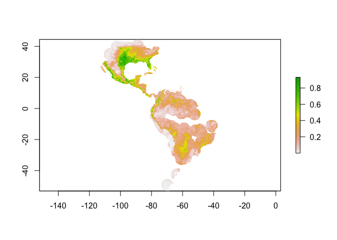<!-- -->

```r
# example 2, project to the world ped2 <- predict(mod,clim)
# plot(ped2)

# example 3, project with training occurrences [dataframes]
ped3 <- predict(mod, p)
head(ped3)
```

```
## [1] 0.7553921 0.3420225 0.5019929 0.5993227 0.7655950 0.7684774
```

```r
hist(ped3)  # creates a histogram of the prediction
```

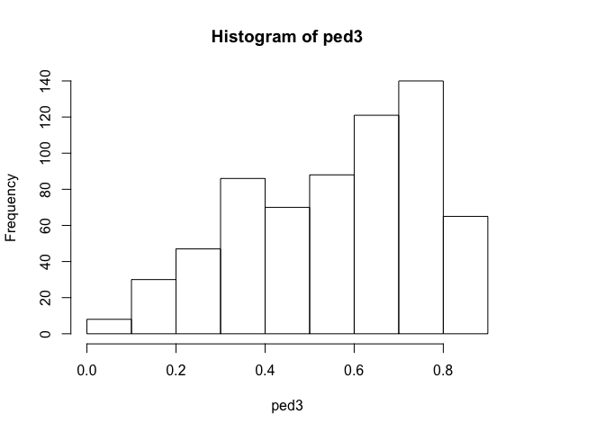<!-- -->

###3.3 Model evaluation
To evaluate models, we use the *evaluate* function from the "dismo" package. Evaluation indices include AUC, TSS, Sensitivity, Specificity, etc.

#####Thread 19

```r
# using 'training data' to evaluate p & a are dataframe/s
# (the p and a are the training presence and background
# points
mod_eval_train <- dismo::evaluate(p = p, a = a, model = mod)
print(mod_eval_train)
```

```
## class          : ModelEvaluation 
## n presences    : 655 
## n absences     : 10000 
## AUC            : 0.8807075 
## cor            : 0.4044683 
## max TPR+TNR at : 0.3175671
```

```r
mod_eval_test <- dismo::evaluate(p = p_test, a = a, model = mod)
print(mod_eval_test)  # training AUC may be higher than testing AUC
```

```
## class          : ModelEvaluation 
## n presences    : 657 
## n absences     : 10000 
## AUC            : 0.8401474 
## cor            : 0.3532565 
## max TPR+TNR at : 0.3763733
```

To threshold our continuous predictions of suitability into binary predictions we use the threshold function of the "dismo" package. To plot the binary prediction, we plot the predictions that are larger than the threshold.  

#####Thread 20

```r
# calculate thresholds of models
thd1 <- threshold(mod_eval_train, "no_omission")  # 0% omission rate 
thd2 <- threshold(mod_eval_train, "spec_sens")  # highest TSS

# plotting points that are above the previously calculated
# tresholded value
plot(ped1 >= thd1)
```

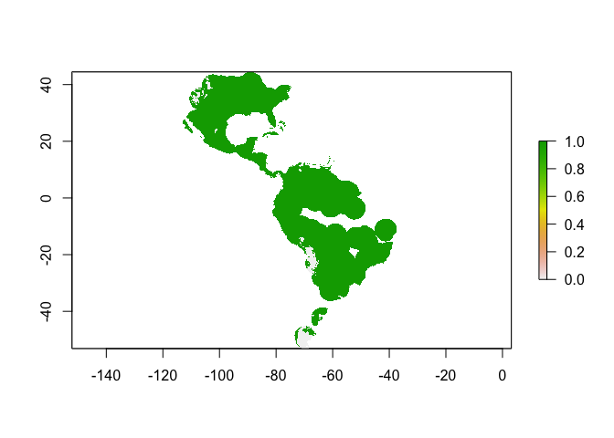<!-- -->

##4 Maxent parameters
###4.1 Select features

#####Thread 21

```r
# load the function that prepares parameters for maxent
source("../code/Appendix2_prepPara.R")

mod1_autofeature <- maxent(x=pder[c("bio1","bio4","bio11")], 
                           ## env conditions, here we selected only 3 predictors
                           p=pa,
                           ## 1:presence or 0:absence
                           path="../output/maxent_outputs1_auto",
                           ## this is the folder you will find manxent output
                           args=prepPara(userfeatures=NULL) ) 
                           ## default is autofeature
              
# or select Linear& Quadratic features
mod1_lq <- maxent(x=pder[c("bio1","bio4","bio11")],
                  p=pa,
                  path=paste0("../output/maxent_outputs1_lq"),
                  args=prepPara(userfeatures="LQ") ) 
                  ## default is autofeature, here LQ represents Linear& Quadratic
                  ## (L-linear, Q-Quadratic, H-Hinge, P-Product, T-Threshold)
```

###4.2 Change beta-multiplier

#####Thread 22

```r
#change betamultiplier for all features
mod2 <- maxent(x=pder[c("bio1","bio4","bio11")], 
               p=pa, 
              path=paste0("../output/maxent_outputs2_0.5"), 
              args=prepPara(userfeatures="LQ",
                            betamultiplier=0.5) ) 

mod2 <- maxent(x=pder[c("bio1","bio4","bio11")], 
               p=pa, 
              path=paste0("../output/maxent_outputs2_complex"), 
              args=prepPara(userfeatures="LQH",
                            ## include L, Q, H features
                            beta_lqp=1.5, 
                            ## use different betamultiplier for different features
                            beta_hinge=0.5 ) ) 
```

###4.3 Specify projection layers

#####Thread 23

```r
# note: (1) the projection layers must exist in the hard disk (as relative to computer RAM); 
# (2) the names of the layers (excluding the name extension) must match the names 
# of the predictor variables; 
mod3 <- maxent(x=pder[c("bio1","bio11")], 
               p=pa, 
              path=paste0("../output/maxent_outputs3_prj1"), 
              args=prepPara(userfeatures="LQ",
                            betamultiplier=1,
                            projectionlayers="/Users/iel82user/Google Drive/1_osu_lab/projects/2017_7_workshop_enm_R/data/studyarea") ) 

# load the projected map
ped <- raster(paste0("../output/maxent_outputs3_prj1/species_studyarea.asc"))
plot(ped)
```

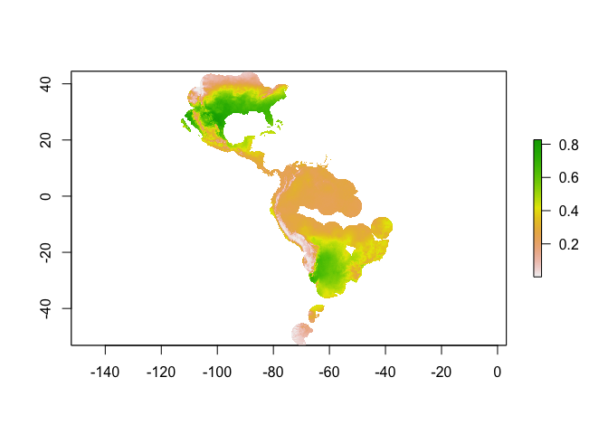<!-- -->

```r
# we can also project on a broader map, but please 
# caustion about the inaccuracy associated with model extrapolation.
mod3 <- maxent(x=pder[c("bio1","bio11")], 
               p=pa, 
              path=paste0("../output/maxent_outputs3_prj2"), 
              args=prepPara(userfeatures="LQ",
                            betamultiplier=1,
                            projectionlayers="/Users/iel82user/Google Drive/1_osu_lab/projects/2017_7_workshop_enm_R/data/bioclim") ) 
# plot the map
ped <- raster(paste0("../output/maxent_outputs3_prj2/species_bioclim.asc"))
plot(ped)
```

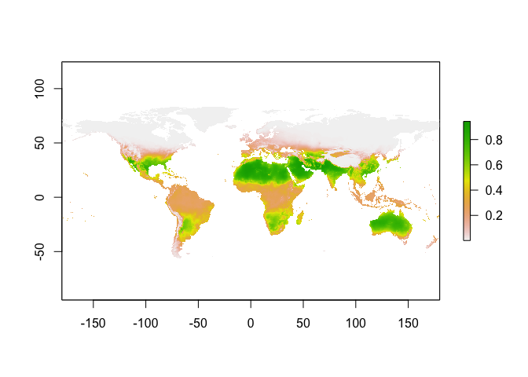<!-- -->

```r
# simply check the difference if we used a different betamultiplier
mod3_beta1 <- maxent(x=pder[c("bio1","bio11")], 
               p=pa, 
              path=paste0("../output/maxent_outputs3_prj3"), 
              args=prepPara(userfeatures="LQ",
                            betamultiplier=100, 
                            ## for an extreme example, set beta as 100
                            projectionlayers="/Users/iel82user/Google Drive/1_osu_lab/projects/2017_7_workshop_enm_R/data/bioclim") ) 
ped3 <- raster(paste0("../output/maxent_outputs3_prj3/species_bioclim.asc"))
plot(ped-ped3) ## quickly check the difference between the two predictions
```

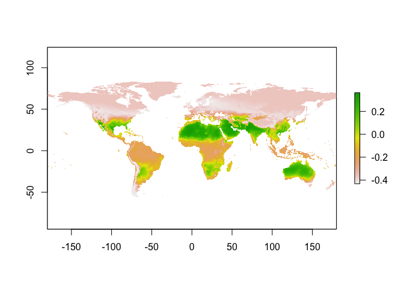<!-- -->

###4.4 Clamping function

#####Thread 24

```r
# enable or disable clamping function; note clamping function
# is involved when projecting
mod4_clamp <- maxent(x = pder[c("bio1", "bio11")], p = pa, path = paste0("../output/maxent_outputs4_clamp"), 
    args = prepPara(userfeatures = "LQ", betamultiplier = 1, 
        doclamp = TRUE, projectionlayers = "/Users/iel82user/Google Drive/1_osu_lab/projects/2017_7_workshop_enm_R/data/bioclim"))

mod4_noclamp <- maxent(x = pder[c("bio1", "bio11")], p = pa, 
    path = paste0("../output/maxent_outputs4_noclamp"), args = prepPara(userfeatures = "LQ", 
        betamultiplier = 1, doclamp = FALSE, projectionlayers = "/Users/iel82user/Google Drive/1_osu_lab/projects/2017_7_workshop_enm_R/data/bioclim"))


ped_clamp <- raster(paste0("../output/maxent_outputs4_clamp/species_bioclim.asc"))
ped_noclamp <- raster(paste0("../output/maxent_outputs4_noclamp/species_bioclim.asc"))
plot(stack(ped_clamp, ped_noclamp))
```

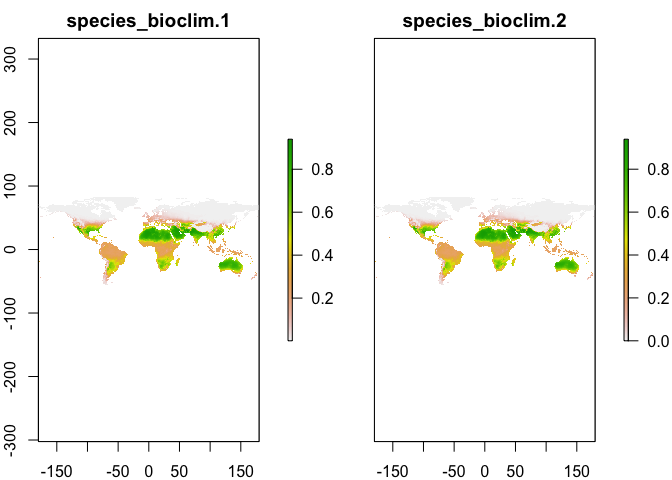<!-- -->

```r
plot(ped_clamp - ped_noclamp)
```

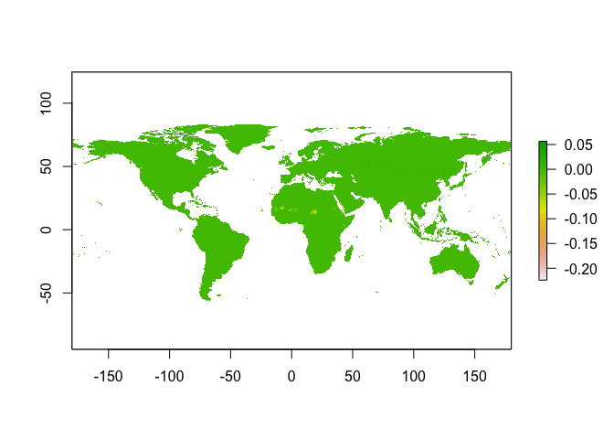<!-- -->

```r
## we may notice small difference, especially clamp shows
## higher predictions in most areas.
```

###4.5 Cross validation

#####Thread 25

```r
mod4_cross <- maxent(x=pder[c("bio1","bio11")], p=pa, 
                            path=paste0("../output/maxent_outputs4_cross"), 
                            args=prepPara(userfeatures="LQ",
                                          betamultiplier=1,
                                          doclamp = TRUE,
                                          projectionlayers="/Users/iel82user/Google Drive/1_osu_lab/projects/2017_7_workshop_enm_R/data/bioclim",
                                          replicates=5, ## 5 replicates
                                          replicatetype="crossvalidate") )
                                          ##possible values are: crossvalidate,bootstrap,subsample
```
